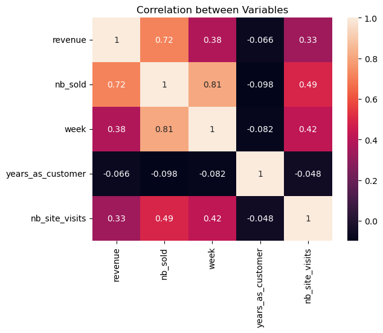
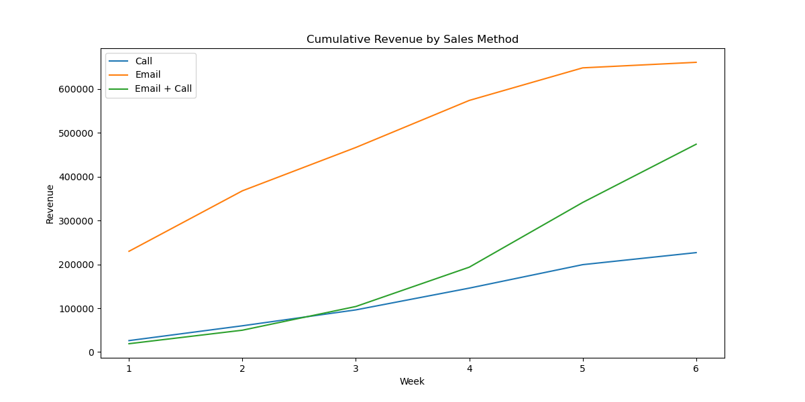
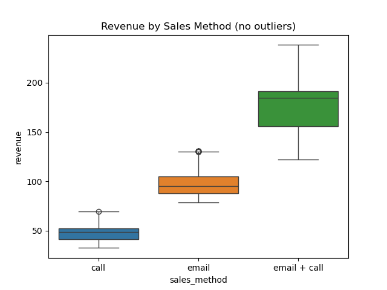
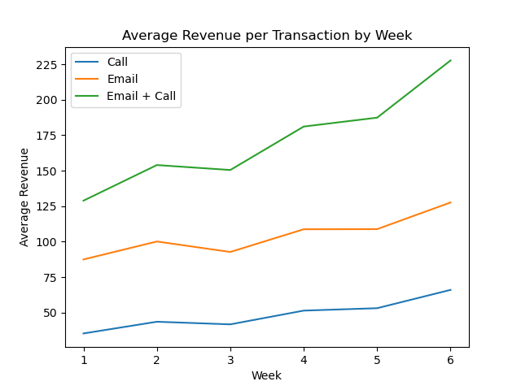
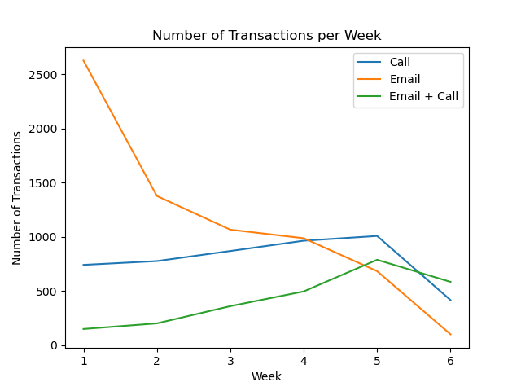
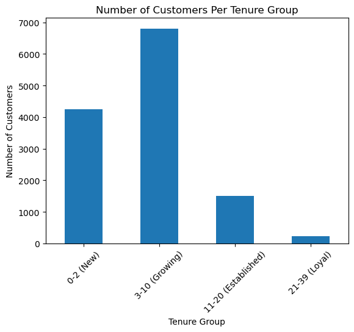
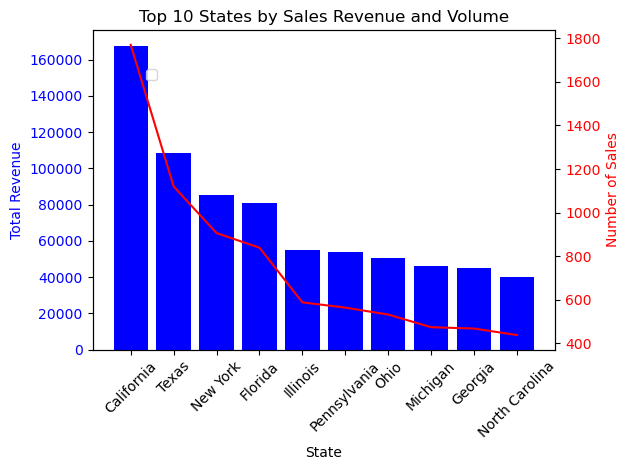
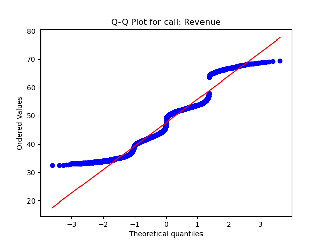
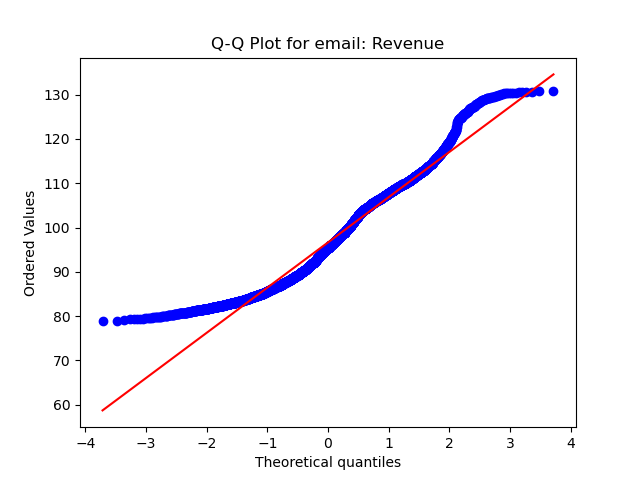

# Sales Strategy Analysis

# Executive Summary 
This project analyzed six weeks of sales data to evaluate the performance of three sales methods—Call, Email, and Email + Call—with the goal of identifying the most effective strategy for maximizing revenue while balancing scalability and efficiency. The analysis involved data cleaning, exploratory analysis, and statistical testing, revealing significant differences in performance. Email was identified as the most scalable method, generating the highest total revenue and transaction volume, while Email + Call was the most efficient per transaction but limited in scalability due to resource demands. Call was found to be the least efficient and least profitable method. Based on these findings, the recommendations include prioritizing Email for its scalability, optimizing Email + Call for high-value customers, and phasing out Call due to its inefficiency. Monitoring weekly revenue by sales method is suggested to ensure continued performance alignment with business objectives.

# Data Validation

The dataset contains 15,000 rows and 8 columns before cleaning and validation. I have validated all the columns against the criteria in the dataset table: 

| **Column Name**       | **Description**                                                                 | **Changes Performed**                                                                                                              |
|------------------------|---------------------------------------------------------------------------------|------------------------------------------------------------------------------------------------------------------------------------|
| `week`                | Week of the sale, counted as weeks since product launch.                         | No changes required; data was already valid and within the expected range (1–6).                                                 |
| `sales_method`        | Sales method used for the customer (Call, Email, Email + Call).                  | Homogenized string cases, standardized categories to include only `call`, `email`, and `email + call`.                           |
| `customer_id`         | Unique identifier for the customer.                                              | Verified uniqueness; no duplicates detected.                                                                                     |
| `nb_sold`             | Number of products sold per transaction (7–16).                                  | No changes required; data was valid.                      |
| `revenue`             | Total revenue from the sale, rounded to 2 decimal places.                        | - Removed 99 outliers based on IQR method.  - Handled missing values:    - Dropped for `call` (3.7%) and `email` (7.4%).    - Imputed for `email + call` (13.6%) using average revenue grouped by `nb_sold`. |
| `years_as_customer`   | Number of years the customer has been buying from the company (founded in 1984). | Removed 2 customers with `years_as_customer` > 40 due to data errors exceeding the company's existence.                          |
| `nb_site_visits`      | Number of times the customer visited the website in the last 6 months.           | No changes required; data was valid and within expected ranges.                                                                  |
| `state`               | Customer's shipping location (e.g., California, Texas).                         | No changes required; verified 50 unique values, matching the 50 U.S. states.                                                     |

After data validation, the dataset contains 14,174 rows and 9 columns. 

# Exploratory Data Analysis
## What is the relationship between numerical variables? 

The heatmap below visualises the correlation between key variables (revenue, nb_sold, week, etc): 

- We can see that there is a moderate positive correlation ( _r = 0.72_ ) between revenue and the number of items sold, this is in line with the fact that the products sold were different. 
- There is a stronger positive correlation ( _r = 0.81_ ), however, between the number of items sold (nb_sold), and the week, sugesting potential time-based trends. 
- There is mild correlation between the number of items sold and the number of website visits. 

 
     

    

## How have sales performed over the last 6 weeks? 

The graph below shows the cummulative revenue generated by each of the sales methods, indicating that 'email' has provided the highest revenue across all three. However, after the first 3 weeks, we can see a noticeable increase in revenue generated by the 'email + call' campaign. The worst performing method was 'call', which has the lowest revenue across all three categories. 

 
     

    

While these numbers may appear to indicate that 'email' is the best sales method when it comes to revenue, it's important to note that the dataset contains a vastly different number of transactions for each sales category. There are a total of 4,768 tansactions for 'call', 6,834 for 'email' and 2572 for 'email + call'. While it is expected that the 'email' method has the highest cummulative revenue, it can be explained by the considerably higher number of transactions, and not necessarely suggest that it is the most profitable.

The boxplot below shows the distribution of revenue per sales method, indicating that, while there is a higher variability of revenue for the 'email + call' method, average values indicate that it holds higher returns per transactions, on average. 

 
     

    
 

## Performance over time

The line plot on the left shows the average revenue generated by each transaction, over the last 6 weeks. We can see an overall increase for each sales method, this is in line with the figure presented before, which suggests that 'email + call' has the highest profitability per transaction. 

On the other hand, the right-side plot shows the number of transactions by sales method for each week. We can see a considerable decrease in the number of transactions for 'email' (from 2626 transactions on week 1 to 99 only on week 6), a minor decrease in number of transactions for the 'call' method (from 740 on week 1 to 415 on week 6) and a noticeable increase for the 'email + call' method (from 148 on week 1 to 583 on week 6)

  
  

## Is there a difference across customer groups? 
 
We'll focus on revenue as our metric for comparison. We segmented customers based on their tenure into four different categories: New (0-2 years), Growing (3-10 years), Established (11-20 years) and Loyal (21-39 years). The bar plot below shows the number of customers belonging to each of the categories. 

 
     

    

It is evident that the most common customer group is 'Growing' and 'New'. In terms of average revenue generated from each of the groups, it is possible to see a negative correlation (albeit negligible) between average revenue and tenure. That is, the bigger the tenure, the lower the average revenue. Differences are minor, however, and further analysis would need to be made to determine if there is a statistically significant difference. 

### Can we notice a difference revenue between customer groups, when combined with sales methods?

The table below shows the average revenue for each of the sales methods, divided by their customer groups: 

| tenure_group       | sales_method   | average_revenue |
|--------------------|----------------|-----------------|
| 0-2 (New)         | call           | 48.254291       |
|                   | email          | 97.232362       |
|                   | email + call   | 186.996289      |
| 3-10 (Growing)    | call           | 47.147525       |
|                   | email          | 96.438521       |
|                   | email + call   | 183.190387      |
| 11-20 (Established) | call         | 46.313134       |
|                   | email          | 95.081310       |
|                   | email + call   | 178.714100      |
| 21-39 (Loyal)     | call           | 45.824048       |
|                   | email          | 94.909375       |
|                   | email + call   | 176.595322      |

These findings are in line with what we mentioned before. Differences across average revenue are very minor and, in fact, highest average revenue can be seen by the two most common customer groups. 

### Where are customers coming from? 

The barplot below shows the top 10 States by their sales revenue (left axis) and their sales count (right axis) . California, Texas and New York represent the top 3, together represent almost 27% of the total revenue of the business. 

 
     

   

## Key findings from Exploratory Data Analysis

Overall Spread: 
- **Email + call** generates the highest average revenue per transaction but has the lowest transaction volume.
- **Email** generates the highest total revenue and transactions. Suggesting it might be the most scalable. 

Revenue Over Time: 
- Average revenue per transaction increases over time for all methods, while transaction volume declines for 'email' and 'call'. 

Differences across customers:
- There seems to be little to no difference between average revenue across tenure groups, even when separated by each of the sales methods. 
- California, Texas and New York represent the best performing states by sales count and revenue. Combined they can account for more than one quarter of the total revenue of the company.

# Statistical Analysis

The purpose of this section is to investigate if there is a statistically significant difference in average revenue generation for each of the sales methods. If so, we can later determine which of these is the best to use as we move forward. 

## Is there a difference in revenue between sales methods? 

### Tests for normality 

First, we need to understand if our data is normally distributed. The table below was calculated by performing Shapiro-Wilk tests for normality for each of the sales methods' 'revenue' column. 

| sales_method   | p_value         | statistic | result                    |
|----------------|-----------------|-----------|---------------------------|
| call           | 1.342326e-39    | 0.942515  | Not Normally Distributed  |
| email          | 1.077739e-40    | 0.957479  | Not Normally Distributed  |
| email + call   | 2.332966e-35    | 0.917418  | Not Normally Distributed  |

We can then confirm this results by performing Q-Q plots for each of the sales methods as an additional test for normality: 

  
  
  

Since the data isn't normally distributed, we will use non-parametric tests to determine whether there is a statistically significant difference in revenue for each of the sales methods. 

### Hypothesis Testing

We will use Kruskal-Wallis tests to compare the sales methods across the groups in the data set, using the following hypothesis: 

- Null Hypothesis: There is no difference in the distributions of revenue across the sales methods.
- Alternative Hypothesis: There is a difference in the distributions of revenue across the sales methods.
- Alpha: 0.05

#### Kruskal-Wallis Test Results

| **Source**      | **ddof1** | **H**           | **p-unc** |
|-----------------|-----------|-----------------|-----------|
| sales_method    | 2         | 11957.12        | 0.0       |

The Kruskal-Wallis test yielded an H-statistic of 11957.12, which indicates significant differences between the sales methods, and a p-value of 0.0, which is less than the 0.05 threshold, allowing us to reject the null hypothesis. Therefore, we conclude that there is a significant difference in the distributions of revenue across the sales methods (call, email, email + call). 

#### Post-hoc pairwise comparisons 

To further explore which specific pairs of sales methods were significantly different, we conducted a post-hoc analysis using pairwise comparisons: 

| Contrast          | A       | B           | Paired | Parametric | T-statistic   | df              | Alternative | p-value | p-corr | p-adjust | BF10  | Hedges' g   |
|-------------------|---------|-------------|--------|------------|---------------|-----------------|-------------|---------|--------|----------|-------|-------------|
| sales_method      | call    | email       | False  | True       | -277.95       | 11303.13        | two-sided   | 0.0     | 0.0    | bonf     | inf   | -5.064      |
| sales_method      | call    | email + call| False  | True       | -232.81       | 2812.37         | two-sided   | 0.0     | 0.0    | bonf     | inf   | -7.366      |
| sales_method      | email   | email + call| False  | True       | -149.05       | 2822.69         | two-sided   | 0.0     | 0.0    | bonf     | inf   | -4.969      |

#### Conclusion

The pairwise comparisons between the sales methods (call, email, and email + call) reveal statistically significant differences in revenue across all pairs. The T-statistics are negative, indicating that for each comparison, the first sales method (A) generally has lower revenue than the second (B). The p-values for all comparisons are 0.0, confirming these differences are highly significant. The effect sizes, as measured by Hedges' g, range from -4.969 to -7.366, suggesting large and meaningful differences between the sales methods.

## Key Findings from Statistical Analysis

- Normality Check: The Shapiro-Wilk tests and Q-Q plots confirmed that the revenue data for each sales method is not normally distributed.
- Kruskal-Wallis Test: The Kruskal-Wallis test revealed significant differences in the distributions of revenue across the sales methods (call, email, email + call), with a p-value of 0.0, allowing us to reject the null hypothesis.
- Post-Hoc Pairwise Comparisons: Further analysis using pairwise comparisons confirmed that all pairs of sales methods (call vs. email, call vs. email + call, email vs. email + call) showed significant differences in revenue. The T-statistics were negative, indicating that the first method (A) generally had lower revenue than the second method (B) in each comparison.

These findings suggest that the choice of sales method (call, email, or email + call) significantly impacts the revenue generated, with substantial differences in performance across the methods.

# Sales method comparison 

Since the test above have shown that there are statistically significant differences in revenue for each of the sales methods, let us now investigate which is the highest performing one. 

The table below shows the average revenue generated per transaction for each of the sales methods: 

| sales_method   | total_revenue | total_transactions | avg_revenue | avg_nb_sold |
|----------------|---------------|--------------------|-------------|-------------|
| call           | 226668.99     | 4768               | 47.54       | 9.49        |
| email          | 660475.80     | 6834               | 96.65       | 9.68        |
| email + call   | 473828.41     | 2572               | 184.23      | 12.23       |

From this table, we can observe the following results: 

- Total Revenue: 
  - **Email** generated the highest total revenue ($660,475.80), followed by **email + call** ($473,828.41), and **call** ($226,668.99).
  
- Total Transactions: 
  - **Email** also led in terms of total transactions, with 6,834 transactions, far surpassing **call** (4,768 transactions) and **email + call** (2,572 transactions).

- Average Revenue per Transaction: 
  - **Email + Call** had the highest average revenue per transaction ($184.23), indicating it generates more revenue per sale compared to the other methods. 
  - **Email** had an average revenue per transaction of $96.65, while **call** generated $47.54 per transaction.

- Average Number of Items Sold:
  - **Email + Call** led in average number of items sold per transaction (12.23), followed by **email** (9.68) and **call** (9.49).

## Which Method is Better?

- **Email** stands out as the most **scalable method** because it generates the highest number of transactions, leading to the highest total revenue. While its average revenue per transaction is lower than **email + call**, the number of transactions compensates for this difference, making it the most efficient in terms of total revenue generation.
  
- **Email + Call**, on the other hand, is the **most efficient per transaction** with higher revenue per sale and more items sold, but its **lower transaction volume** means it generates less total revenue compared to **email**.

- **Call** is the **least efficient** in terms of both total revenue and average revenue per transaction, making it the least favorable method for maximizing revenue.

### **Conclusion**
If the goal is to **maximize total revenue**, **email** is the best method due to its **higher transaction volume**. However, if **higher revenue per transaction** is prioritized, **email + call** may be the better choice, though it sacrifices scalability. For businesses seeking scalability and higher total revenue, **email** is recommended.

# Final thoughts, recommendations and metrics to follow

## Proposed Metric to follow: Revenue per Week by Sales Method
To evaluate the performance of sales strategies effectively, the business should monitor **weekly revenue** for each sales method. This metric combines the benefit of assessing both the **scalability** (transaction volume) and **efficiency** (revenue per transaction) of each sales method. By analyzing revenue on a weekly basis, trends over time—such as diminishing performance of a sales method or growth in another—can be identified early and acted upon.

### Thresholds for Evaluation:
   - Establish baselines for acceptable weekly revenue per sales method based on historical data.
   - For example:
     - **Email**: Should maintain at least $100,000 per week in total revenue.
     - **Email + Call**: Should maintain at least $75,000 per week to justify its higher resource costs.
     - **Call**: Should maintain at least $35,000 per week or be phased out if the cost-to-revenue ratio becomes unfavorable.

### Initial Metric Values (Based on Current Data):
The table below summarizes average weekly revenue per sales method over the 6-week period:

| **Sales Method** | **Average Weekly Revenue ($)** |
|-------------------|-------------------------------|
| Call             | 37,778.16                     |
| Email            | 110,079.30                    |
| Email + Call     | 78,971.40                     |

These initial values can serve as benchmarks for monitoring weekly performance.

---

## Final Summary and Recommendations

### Key Findings:
1. **Email is the most scalable method**: With the highest transaction volume (6,834) and the highest total revenue ($660,475.80), it is the most effective strategy for maximizing overall revenue.
2. **Email + Call is the most efficient per transaction**: It generates the highest average revenue per transaction ($184.23), but the lower transaction volume (2,572) limits its scalability.
3. **Call is the least favorable method**: It has the lowest total revenue ($226,668.99) and average revenue per transaction ($47.54), making it the least efficient.

### Recommendations:
1. **Prioritize the Email Sales Method**:
   - Focus on scaling this method further as it produces the highest revenue and transaction volume.
   - Address the sharp decline in email transactions over time (from 2,626 in week 1 to 99 in week 6) by investigating customer engagement and campaign longevity.

2. **Optimize the Email + Call Method**:
   - Retain this method for high-value customers or premium products where maximizing revenue per transaction is critical.
   - Investigate ways to streamline the process to reduce resource demands and increase transaction volume without sacrificing efficiency.

3. **Phase Out the Call Method**:
   - With the lowest efficiency and scalability, this method offers limited strategic value.
   - Transition resources allocated to this method toward improving email and email + call strategies.

4. **Monitor Performance Using Revenue Metrics**:
   - Track weekly revenue and transaction volume for each method.
   - Reassess periodically to ensure the chosen strategies continue to align with business objectives.

By implementing these recommendations, the business can focus resources on methods that maximize revenue and efficiency, ensuring sustained growth and profitability.
